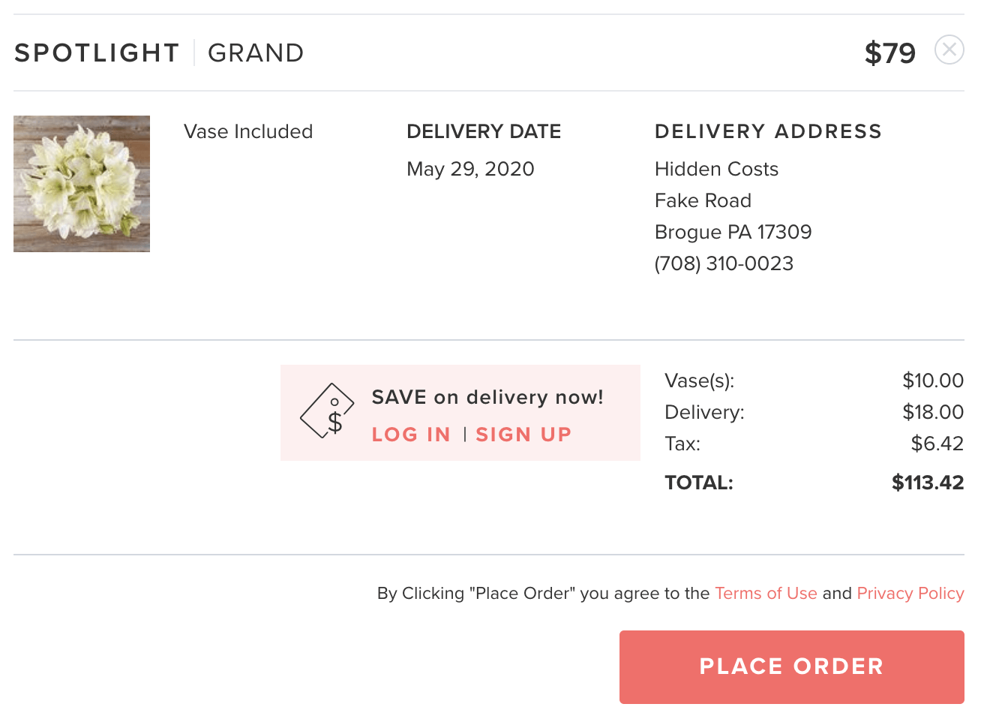

# Detecting Dark Pattern Signals Using Behavioral Analytics in E-Commerce

### Problem Statement
- E-commerce platforms are heavily optimized for maximizing conversions and revenue. However, aggressive optimization strategies can unintentionally introduce user experience (UX) friction or manipulative design elements commonly referred to as **dark patterns** that influence user behavior in ways that may reduce trust and long-term customer value.
Such patterns often manifest as repeated cart interactions, prolonged decision-making without conversion, or frequent abandonment during checkout. While these behaviors do not explicitly prove unethical design, they act as **behavioral risk signals** that warrant investigation.

- This project aims to analyze user journey and session-level behavioral data to identify friction indicators that may suggest potential dark pattern risks in an e-commerce environment. By examining funnel drop-offs, cart interactions, session duration, and abandonment behavior, the analysis seeks to quantify how these signals impact conversion performance. The ultimate objective is not to accuse or label design practices, but to provide **data-driven insights** that help businesses balance conversion goals with ethical, user-centric design—supporting improved trust, retention, and sustainable growth.
         
